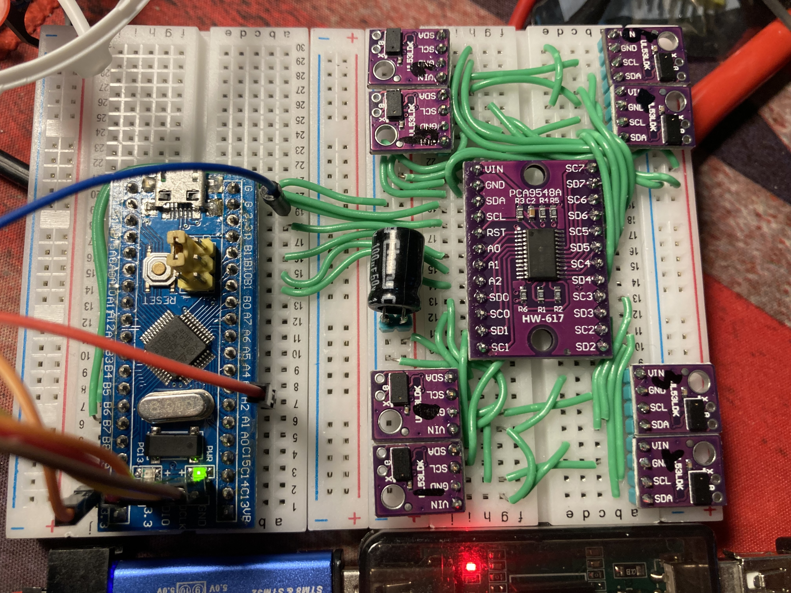
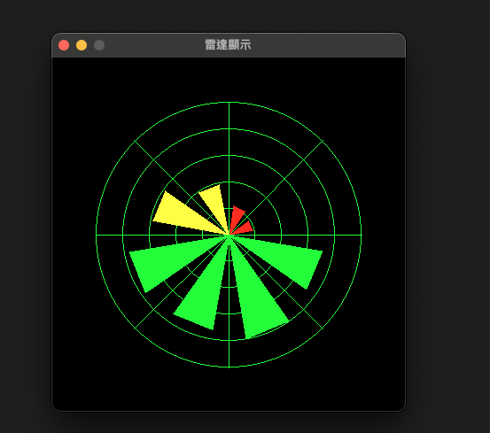

# 多個 VL53L0X 感測器數據讀取系統

Video:
https://youtu.be/OrfpyjqpGTM

這個項目利用 Arduino 和 TCA9548 I2C 多路轉換器來讀取多個 VL53L0X 激光測距感測器的數據。
這是一個低成本的避障方案，成本預估會在 10usd 以下。
VL53L0x 約 0.9usd
TCA9548 約 0.2usd
F103c8t6 約 1usd


## 功能

- 通過 TCA9548 I2C 多路轉換器同時管理最多 8 個 VL53L0X 感測器。
- 從每個感測器讀取距離數據並計算平均值，以減少隨機誤差。
- 通過串行埠以特定格式傳送平均距離數據。
  

## 硬件要求

- Arduino 或相容板
- TCA9548 I2C 多路轉換器
- 最多 8 個 VL53L0X 激光測距感測器
- 適當的連接線

## 接線指南

將 TCA9548 的 SDA 和 SCL 接線至 Arduino 的 SDA_PIN 和 SCL_PIN，並將各個 VL53L0X 感測器連接至 TCA9548 的各個通道。

## 使用說明

1. 將代碼上傳至您的 Arduino。
2. 打開串行監視器查看來自感測器的數據。
3. 觀察串行埠輸出，確認感測器數據正確傳輸。

## 代碼說明

代碼包含以下幾個部分：

- 初始化並設置串行通訊速率。
- 初始化 TCA9548 I2C 多路轉換器。
- 循環讀取每個通道的 VL53L0X 感測器數據並存儲。
- 計算每個感測器的平均距離並通過串行埠發送。

## Python 工具

安裝相依

```
pip install -r requirements.txt
```

運行

```
python gui.py
```

## 注意事項

- 確保所有感測器均正確連接且沒有地址衝突。
- 可能需要根據您的硬件設置調整 I2C 地址和引腳配置。

## 貢獻

如果您有任何建議或改進，歡迎提交 pull request 或開啟 issue。
